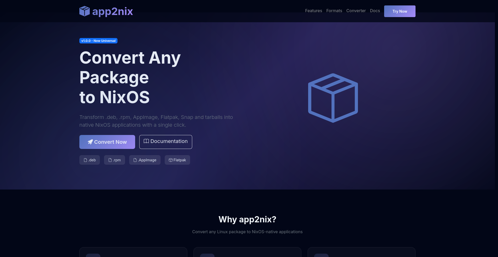
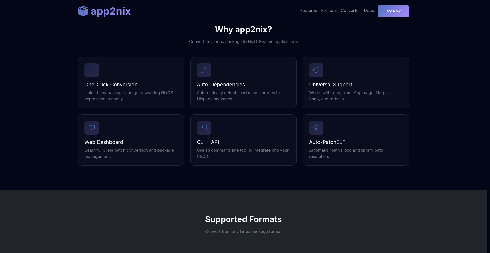
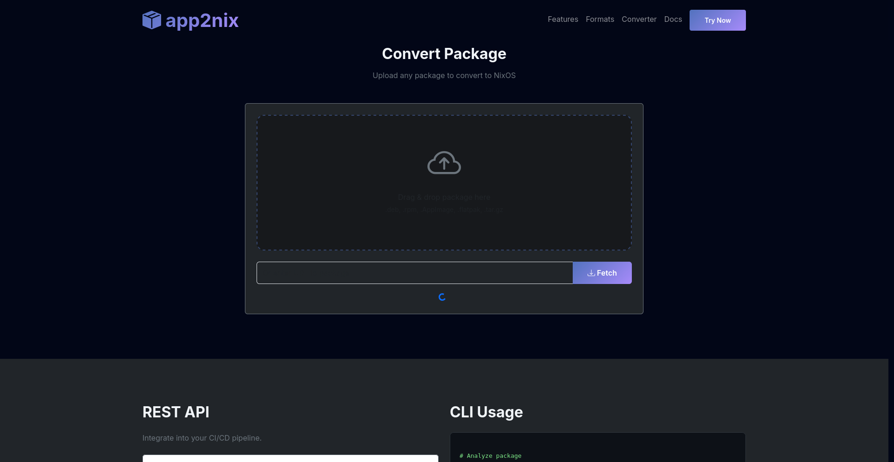
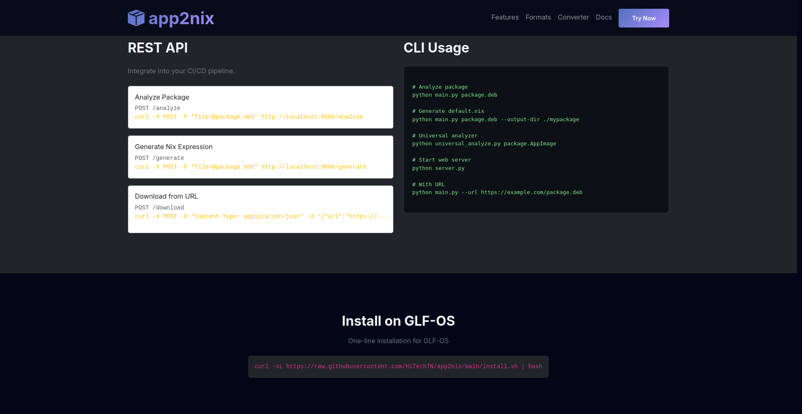

# app2nix - Universal Package to NixOS Converter

<p align="center">

[](https://github.com/HiTechTN/app2nix/stargazers)
[](https://github.com/HiTechTN/app2nix/network/members)
[](LICENSE)
[](https://github.com/HiTechTN/app2nix/releases)

</p>

<div align="center">

### Transform any Linux package into a NixOS native application with one click

[](https://github.com/HiTechTN/app2nix/actions)
[](https://github.com/HiTechTN/app2nix/actions)
[](https://github.com/HiTechTN/app2nix/actions)
[](https://github.com/HiTechTN/app2nix/releases/latest)

[Documentation](docs/) · [Report Bug](https://github.com/HiTechTN/app2nix/issues) · [Request Feature](https://github.com/HiTechTN/app2nix/issues)

</div>

---

## ✨ What is app2nix?

**app2nix** converts Linux packages from any format (`.deb`, `.rpm`, `.AppImage`, Flatpak, Snap, tarball) into ready-to-use NixOS expressions. No more manual dependency hunting - let app2nix handle the complexity.

### 🎯 Why NixOS?

- **Reproducible builds** - Same result every time
- **Declarative config** - Your entire system in code
- **Rollback support** - Never break your system
- **Atomic updates** - All or nothing
- **Multi-version** - Run different versions side by side

---

## 🚀 Features

| Feature | Description |
|---------|-------------|
| 🌐 **Web UI** | Beautiful drag-and-drop interface for instant conversion |
| ⚡ **Auto-Dependencies** | Automatically detects and maps 150+ libraries to Nixpkgs |
| 📦 **Universal Formats** | Supports .deb, .rpm, .AppImage, Flatpak, Snap, tar.gz |
| 🖥️ **CLI Tool** | Scriptable conversion for CI/CD pipelines |
| 🔌 **REST API** | Integrate into your own applications |
| 🔧 **Auto-PatchELF** | Automatic rpath fixing and binary patching |
| 🎨 **Nix Expression Generator** | Outputs production-ready `default.nix` files |

---

## 📸 Screenshots

### Web Interface


### Features Section


### Package Converter


### API Documentation


---

## 📦 Supported Formats

| Format | Extension | Distros | Status |
|--------|----------|---------|--------|
| 🟠 Debian | `.deb` | Ubuntu, Debian, Mint | ✅ Stable |
| 🔴 RPM | `.rpm` | Fedora, RHEL, CentOS | ✅ Stable |
| 🟡 AppImage | `.AppImage` | Universal | ✅ Stable |
| 🔵 Flatpak | `.flatpak` | Universal | 🟡 Beta |
| 🟢 Snap | `.snap` | Ubuntu | 🟡 Beta |
| ⚪ Tarball | `.tar.gz` | Universal | ✅ Stable |

---

## 🛠️ Quick Start

### Option 1: Web UI (Recommended for Beginners)

```bash
# Clone the repo
git clone git@github.com:HiTechTN/app2nix.git
cd app2nix

# Install dependencies
pip install -e .

# Start the web server
python server.py

# Open your browser
xdg-open http://localhost:8000
```

### Option 2: CLI (For Automation)

```bash
# Analyze a .deb file
python main.py package.deb

# Generate Nix expression
python main.py package.deb --output-dir ./myapp

# Print dependencies only
python main.py package.deb --print-deps

# Download from URL
python main.py --url https://example.com/package.deb
```

### Option 3: Python API

```python
from analyze_deb import get_all_dependencies
from lib.deb_to_nix import translate_all

# Analyze package
info = get_all_dependencies("package.deb")

# Get Nix dependencies
nix_deps = translate_all(info["dependencies"])

print(f"Nix packages: {nix_deps}")
```

---

## 🌐 Interactive Demo

Try app2nix without installing:

```bash
# Using Docker
docker run -p 8000:8000 ghcr.io/hitechtn/app2nix:latest

# Open http://localhost:8000
```

Or test online at **[app2nix.dev](https://hitechtn.github.io/app2nix)**

---

## 📚 Documentation

| Document | Description |
|----------|-------------|
| [Installation Guide](docs/INSTALL.md) | How to install app2nix |
| [Usage Guide](docs/USAGE.md) | Detailed usage instructions |
| [API Reference](docs/API.md) | REST API documentation |
| [Examples](docs/EXAMPLES.md) | Real-world examples |
| [FAQ](docs/FAQ.md) | Frequently asked questions |

---

## 🏗️ Architecture

```
app2nix/
├── main.py                 # CLI interface
├── server.py              # Starlette web server
├── universal_analyze.py  # Universal package analyzer
├── analyze_deb.py         # .deb package analyzer
├── lib/
│   └── deb_to_nix.py     # Library → Nixpkgs mapping (150+ libraries)
├── utils/
│   └── __init__.py      # Utility functions
├── static/
│   └── index.html       # Web UI
├── templates/
│   └── default.nix      # Nix expression template
├── tests/                # Unit tests
├── docs/                 # Documentation
│   └── screenshots/     # UI screenshots
└── install.sh           # One-line installer
```

---

## 🤝 Contributing

Contributions are welcome! Please feel free to submit a Pull Request.

1. Fork the repository
2. Create your feature branch (`git checkout -b feature/amazing`)
3. Commit your changes (`git commit -m 'Add amazing feature'`)
4. Push to the branch (`git push origin feature/amazing`)
5. Open a Pull Request

---

## 📊 Project Stats

| Metric | Badge |
|--------|-------|
| ⭐ Stars | [](https://github.com/HiTechTN/app2nix/stargazers) |
| 🍴 Forks | [](https://github.com/HiTechTN/app2nix/network/members) |
| 🐛 Issues | [](https://github.com/HiTechTN/app2nix/issues) |
| ⬇️ Downloads | [](https://github.com/HiTechTN/app2nix/releases) |

---

## 📄 License

This project is licensed under the MIT License - see the [LICENSE](LICENSE) file for details.

---

## 🙏 Acknowledgments

- [NixOS](https://nixos.org/) - For the amazing package manager
- [Nixpkgs](https://github.com/NixOS/nixpkgs) - For the extensive package collection
- [dpkg](https://wiki.debian.org/dpkg) - For .deb package handling
- Contributors and users of app2nix

---

<div align="center">

Made with ❤️ by [HiTechTN](https://github.com/HiTechTN)

⭐ Star this repo if app2nix helps you!

</div>