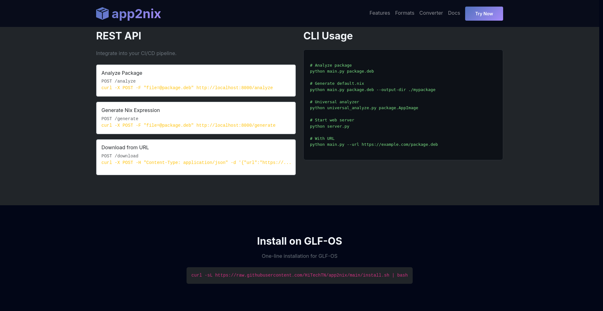

# app2nix - Universal Package to NixOS Converter

<p align="center">

[](https://github.com/HiTechTN/app2nix/stargazers)
[](https://github.com/HiTechTN/app2nix/network/members)
[](LICENSE)
[](https://github.com/HiTechTN/app2nix/releases)
[](https://app2nix.dev/rustdoc/app2nix/index.html)

</p>

<div align="center">

### Transform any Linux package into a NixOS native application with one click

[](https://github.com/HiTechTN/app2nix/actions)
[](https://github.com/HiTechTN/app2nix/actions)
[](https://github.com/HiTechTN/app2nix/actions/workflows/tests.yml)
[](https://github.com/HiTechTN/app2nix/actions/workflows/ruff.yml)
[](https://github.com/HiTechTN/app2nix/actions/workflows/mypy.yml)
[](https://github.com/HiTechTN/app2nix/actions/workflows/ci.yml)
[](https://coveralls.io/github/HiTechTN/app2nix)
[](https://github.com/HiTechTN/app2nix/actions)
[](https://github.com/HiTechTN/app2nix/releases/latest)
[](https://pypi.org/project/app2nix)
[](https://pypi.org/project/app2nix)
[](https://pypi.org/project/app2nix)
[](https://pypi.org/project/app2nix)

[Documentation](https://github.com/HiTechTN/app2nix/blob/master/docs/index.html) · [Report Bug](https://github.com/HiTechTN/app2nix/issues) · [Request Feature](https://github.com/HiTechTN/app2nix/issues)

</div>

---

## ✨ What is app2nix?

**app2nix** converts Linux packages from any format (`.deb`, `.rpm`, `.AppImage`, Flatpak, Snap, tarball) into ready-to-use NixOS expressions. No more manual dependency hunting - let app2nix handle the complexity.

### 🎯 Why NixOS?

- **Reproducible builds** - Same result every time
- **Declarative config** - Your entire system in code
- **Rollback support** - Never break your system
- **Atomic updates** - All or nothing
- **Multi-version** - Run different versions side by side

---

## 🚀 Features

| Feature | Description |
|---------|-------------|
| 🌐 **Web UI** | Beautiful drag-and-drop interface for instant conversion |
| ⚡ **Auto-Dependencies** | Automatically detects and maps 150+ libraries to Nixpkgs |
| 📦 **Universal Formats** | Supports .deb, .rpm, .AppImage, Flatpak, Snap, tar.gz |
| 🖥️ **CLI Tool** | Scriptable conversion for CI/CD pipelines |
| 🔌 **REST API** | Integrate into your own applications |
| 🔧 **Auto-PatchELF** | Automatic rpath fixing and binary patching |
| 🎨 **Nix Expression Generator** | Outputs production-ready `default.nix` files |

---

## 📸 Screenshots

### Web Interface


### Features Section


### Package Converter


### API Documentation


---

## 📦 Supported Formats

| Format | Extension | Distros | Status |
|--------|----------|---------|--------|
| 🟠 Debian | `.deb` | Ubuntu, Debian, Mint | ✅ Stable |
| 🔴 RPM | `.rpm` | Fedora, RHEL, CentOS | ✅ Stable |
| 🟡 AppImage | `.AppImage` | Universal | ✅ Stable |
| 🔵 Flatpak | `.flatpak` | Universal | 🟡 Beta |
| 🟢 Snap | `.snap` | Ubuntu | 🟡 Beta |
| ⚪ Tarball | `.tar.gz` | Universal | ✅ Stable |

---

## 🛠️ Quick Start

### Installation

```bash
# From PyPI (recommended)
pip install app2nix

# With GUI
pip install "app2nix[gui]"

# From source
git clone https://github.com/HiTechTN/app2nix.git
cd app2nix && pip install -e .
```

### CLI

```bash
# Convert a .deb
app2nix convert package.deb

# Convert a .rpm
app2nix convert package.rpm --output-dir ./myapp

# Also generate flake.nix (default in v3.0)
app2nix convert package.deb

# Print dependencies
app2nix convert package.deb --print-deps

# Start the web server
app2nix serve

# Graphical interface (requires pip install "app2nix[gui]")
app2nix gui
```

### Web UI

```bash
app2nix serve
# Open http://localhost:8000
```

### Docker

```bash
docker run -p 8000:8000 -e APP2NIX_SECRET_KEY=mysecret ghcr.io/hitechtn/app2nix:latest
```

---

## 🌐 Interactive Demo

Try app2nix without installing:

```bash
# Using Docker
docker run -p 8000:8000 ghcr.io/hitechtn/app2nix:latest

# Open http://localhost:8000
```

Or test online at **[app2nix.dev](https://hitechtn.github.io/app2nix)**

---

## 📚 Documentation

| Resource | Description |
|----------|-------------|
| [📖 Full Documentation](docs/index.html) | Complete HTML guide — install, CLI, API, examples, architecture, FAQ |
| [Installation Guide](docs/INSTALL.md) | How to install app2nix |
| [Usage Guide](docs/USAGE.md) | Detailed usage instructions |
| [API Reference](docs/API.md) | REST API documentation |
| [Examples](docs/EXAMPLES.md) | Real-world examples |
| [FAQ](docs/FAQ.md) | Frequently asked questions |

---

## 🏗️ Architecture

```
app2nix/
├── src/app2nix/
│   ├── __init__.py       # Package init, version
│   ├── cli.py            # Typer CLI (app2nix convert/serve/gui)
│   ├── config.py         # Settings via pydantic-settings
│   ├── models.py         # PackageInfo, ConversionResult (pydantic)
│   ├── logging.py        # Structured logging
│   ├── exceptions.py     # Custom exceptions
│   ├── core/
│   │   ├── analyzer.py       # UniversalAnalyzer
│   │   ├── analyzers/        # Format-specific analyzers
│   │   ├── generator.py      # NixGenerator (default.nix, flake.nix)
│   │   ├── resolver.py       # DependencyResolver (150+ libs)
│   │   └── validator.py      # Nix expression validator
│   ├── gui/
│   │   ├── __init__.py       # run_gui() entry point
│   │   ├── main_window.py    # PyQt6 GUI with QThread workers
│   │   ├── i18n.py           # Internationalization
│   │   ├── theme.py          # Light/dark theme
│   │   └── templates/        # Jinja2 install guide
│   └── server.py         # Starlette web server
├── static/
│   └── index.html        # Web UI
├── templates/
│   ├── default.nix.j2    # Nix expression template
│   └── flake.nix.j2      # Flake expression template
├── tests/                # Unit & GUI tests
├── docs/                 # Documentation
├── main.py               # Deprecated → use app2nix CLI
├── server.py             # Deprecated → use app2nix serve
└── app2nix_gui.py        # Deprecated → use app2nix gui
```

---

## 🦀 Rust Core Engine

The conversion pipeline is powered by a **Rust workspace** of **13 crates** (12 libraries + 1 CLI binary) with **245+ unit, integration & doc tests** and zero clippy warnings.

| Badge | Description |
|-------|-------------|
| [](https://app2nix.dev) | API & user documentation |
| [](https://app2nix.dev/rustdoc/app2nix/index.html) | Generated rustdoc for all 13 crates |
| [](https://github.com/HiTechTN/app2nix/actions/workflows/tests.yml) | 245+ tests pass on CI |
| [](https://github.com/HiTechTN/app2nix/actions/workflows/ci.yml) | Zero warnings |
| [](https://github.com/HiTechTN/app2nix/tree/master/crates) | 12 doc-tests across 5 crates |
| [](https://github.com/HiTechTN/app2nix/blob/master/rust-toolchain.toml) | Minimum supported Rust version (rust-toolchain.toml) |

### Crate Architecture

```
crates/                         # 13 Rust crates (12 lib + 1 bin)
├── cli/                        # CLI binary (clap-based entry point)
├── core/                       # Shared types, errors, pipeline orchestration
├── detector/                   # Package format detection (magic bytes, extensions)
├── extractor/                  # File extraction (deb, rpm, tar, zip, AppImage)
├── analyzer/                   # Package metadata & dependency analysis
├── resolver/                   # Dependency resolution (150+ lib → Nixpkgs map)
├── nixgen/                     # Nix expression generation (default.nix, flake.nix)
├── patcher/                    # Binary patching (rpath, shebangs, ELF)
├── desktop/                    # Desktop entry & icon integration
├── installer/                  # Installation logic & conflict resolution
├── sandbox/                    # Sandboxed extraction (bubblewrap)
├── fhs/                        # FHS compatibility environment (buildFHSUserEnv)
├── plugins/                    # Plugin system for custom analyzers
└── tests/rust/                 # Integration tests crate (27 end-to-end tests)
```

Documentation is embedded as **doctests** in public API functions — examples that compile and run as tests:

```bash
# Run all Rust tests (unit + integration + doctests)
cargo test --workspace

# Test a specific crate
cargo test -p app2nix-detector
cargo test -p app2nix-resolver

# Run integration tests only
cargo test -p app2nix-tests

# Check formatting & lints
cargo fmt --check
cargo clippy --workspace
```

---

## 🤝 Contributing

Contributions are welcome! Please feel free to submit a Pull Request.

1. Fork the repository
2. Create your feature branch (`git checkout -b feature/amazing`)
3. Commit your changes (`git commit -m 'Add amazing feature'`)
4. Push to the branch (`git push origin feature/amazing`)
5. Open a Pull Request

---

## 📊 Project Stats

| Metric | Badge |
|--------|-------|
| ⭐ Stars | [](https://github.com/HiTechTN/app2nix/stargazers) |
| 🍴 Forks | [](https://github.com/HiTechTN/app2nix/network/members) |
| 🐛 Issues | [](https://github.com/HiTechTN/app2nix/issues) |
| ⬇️ Binary | [](https://github.com/HiTechTN/app2nix/releases) |
| ✅ Coverage | [](https://coveralls.io/github/HiTechTN/app2nix) |
| 🦀 Rust Tests | [](https://github.com/HiTechTN/app2nix/actions/workflows/tests.yml) |
| 🔧 Clippy | [](https://github.com/HiTechTN/app2nix/actions/workflows/ci.yml) |
| 🐍 Ruff | [](https://github.com/HiTechTN/app2nix/actions/workflows/ruff.yml) |
| 📝 Mypy | [](https://github.com/HiTechTN/app2nix/actions/workflows/mypy.yml) |
| 📦 Version | [](https://github.com/HiTechTN/app2nix/releases/latest) |
| 🐍 PyPI | [](https://pypi.org/project/app2nix) |
| ⬇️ PyPI Downloads | [](https://pypi.org/project/app2nix) |
| 🐍 Python | [](https://pypi.org/project/app2nix) |
| 📜 License | [](https://pypi.org/project/app2nix) |

---

## 📄 License

This project is licensed under the MIT License - see the [LICENSE](LICENSE) file for details.

---

## 🙏 Acknowledgments

- [NixOS](https://nixos.org/) - For the amazing package manager
- [Nixpkgs](https://github.com/NixOS/nixpkgs) - For the extensive package collection
- [dpkg](https://wiki.debian.org/dpkg) - For .deb package handling
- All [contributors](AUTHORS.md) and users of app2nix

---

<div align="center">

Made with ❤️ by [HiTechTN](https://github.com/HiTechTN)

⭐ Star this repo if app2nix helps you!

</div>

---

<p align="center">
  <small>Copyright &copy; 2026 app2nix. MIT License.</small>
</p>
