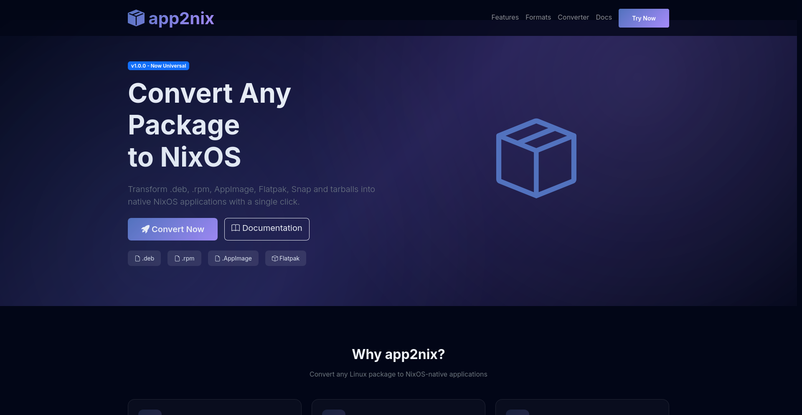
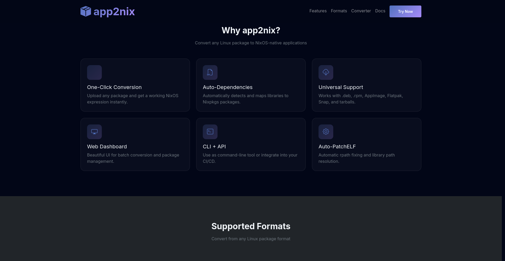
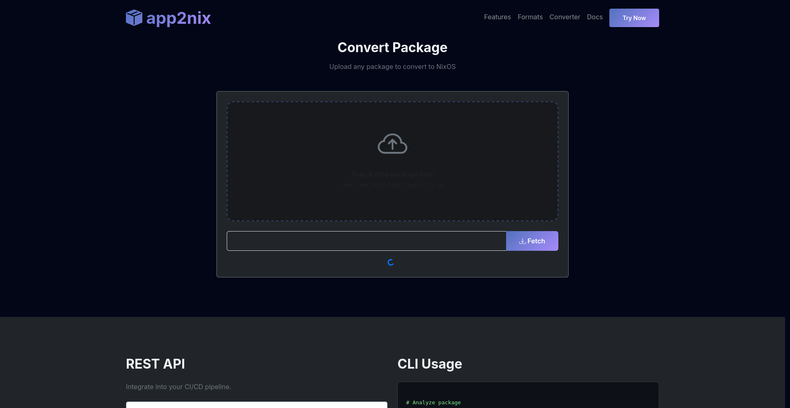

<div align="center">



# app2nix

**Convert any Linux package to NixOS — automatically.**

[](https://github.com/HiTechTN/app2nix/actions/workflows/ci.yml)
[](https://github.com/HiTechTN/app2nix/releases/latest)
[](https://pypi.org/project/app2nix)
[](https://ghcr.io/hitechtn/app2nix)
[](LICENSE)
[](https://hitechtn.github.io/app2nix/)

[Live Demo](https://hitechtn.github.io/app2nix/) | [Quick Start](#-quick-start) | [Formats](#-supported-formats) | [Docs](#-documentation) | [What's New](#-whats-new-in-v302) | [Contributing](#-contributing)

</div>

---

## What it does

app2nix takes a `.deb`, `.rpm`, `.AppImage`, Flatpak, Snap, or tarball and produces a ready-to-use NixOS expression — with dependency resolution, ELF patching, and desktop integration.

## What's New in v3.0.2

🚀 **NixOS GUI** — One-click install with `nix-shell` fallback for PyQt6 compatibility  
📦 **New formats** — `.tar.bz2` and `.tar.xz` support with alias detection (`.txz`, `.tbz2`)  
🏗️ **Architecture mapping** — Proper Nix system strings (amd64→x86_64-linux, arm64→aarch64-linux)  
🔧 **Simplified resolver** — Removed SQLite cache, added dependency deduplication  
🧪 **189 unit tests** — Server edge cases, upload boundaries, temp cleanup, format detection  

[**→ Release notes**](https://github.com/HiTechTN/app2nix/releases/tag/v3.0.2)

```
$ app2nix convert firefox.deb
  Analyzing... found 47 dependencies
  Resolving... 47/47 mapped to Nixpkgs
  Generating... default.nix + flake.nix
  Done in 3.2s
```

## Quick Start

### Docker (recommended)

```bash
docker run -p 8000:8000 ghcr.io/hitechtn/app2nix:latest
# Open http://localhost:8000
```

### pip

```bash
pip install app2nix          # CLI only
pip install "app2nix[gui]"   # with PyQt6 GUI
```

### Use

```bash
# Convert a package
app2nix convert package.deb

# With custom output
app2nix convert package.rpm --output-dir ./result

# See dependencies without converting
app2nix convert package.deb --print-deps

# Start web UI
app2nix serve
# -> http://localhost:8000

# Start GUI
app2nix gui
```

## Live Converter

Try the converter directly in your browser at **[hitechtn.github.io/app2nix/](https://hitechtn.github.io/app2nix/)**.

You'll need to start the backend first:

```bash
docker run -p 8000:8000 ghcr.io/hitechtn/app2nix:latest
```

## Supported Formats

| Format | Extension | Status |
|--------|-----------|--------|
| Debian | `.deb` | Stable |
| RPM | `.rpm` | Stable |
| AppImage | `.AppImage` | Stable |
| Flatpak | `.flatpak` | Beta |
| Snap | `.snap` | Beta |
| Tarball | `.tar.gz`, `.tar.xz`, `.tar.bz2` | Stable |

## How it works

```
Package -> Detect -> Extract -> Analyze -> Resolve -> Patch -> Generate
  .deb     format    files     ELF      150+ libs   rpath   default.nix
  .rpm               deps      metadata  -> Nixpkgs  interp  flake.nix
  .AppImage          icons     desktop
```

1. **Detect** — identifies format from magic bytes or extension
2. **Extract** — unpacks to a temporary directory
3. **Analyse** — finds ELF binaries, shared libraries, desktop entries
4. **Resolve** — maps library names to Nixpkgs packages (150+ entries)
5. **Patch** — fixes rpaths and interpreters via patchelf
6. **Generate** — outputs `default.nix` and `flake.nix`

## Architecture

<details>
<summary><b>Python</b> — CLI, GUI, web server, analyzers</summary>

```
src/app2nix/
  cli.py              # Typer CLI (convert, serve, gui)
  server.py           # Starlette web API
  models.py           # PackageInfo, ConversionResult
  core/
    analyzer.py       # UniversalAnalyzer (format dispatch)
    analyzers/        # deb, rpm, appimage, flatpak, snap, tarball
    _elf_utils.py     # Shared ELF helpers
    resolver.py       # DependencyResolver (DEP_MAP)
    generator.py      # NixGenerator (Jinja2)
    validator.py      # nix-instantiate check
  gui/
    main_window.py    # PyQt6 GUI
    i18n.py           # en, fr, ar
    theme.py          # light / dark
```
</details>

<details>
<summary><b>Rust</b> — 12 library crates + 1 CLI binary</summary>

```
crates/
  cli/         # clap binary
  core/        # Traits, Pipeline, types, errors
  detector/    # Magic bytes + extension detection
  extractor/   # deb, rpm, tar, zip, AppImage extraction
  analyzer/    # ELF analysis, desktop entry detection
  resolver/    # Levenshtein fuzzy matching + dep map
  nixgen/      # Nix derivation generation
  patcher/     # rpath, interpreter, wrapper scripts
  desktop/     # XDG .desktop + icon registration
  installer/   # nix build / install / uninstall
  sandbox/     # Sandbox + FHS compatibility
  plugins/     # PipelineBuilder + plugin system
  tests/       # Integration tests
```
</details>

## Documentation

| | |
|---|---|
| [Live Demo](https://hitechtn.github.io/app2nix/) | Web converter |
| [Full Docs](https://hitechtn.github.io/app2nix/index.html) | Complete guide |
| [API Reference](docs/API.md) | REST API |
| [Examples](docs/EXAMPLES.md) | Real-world usage |
| [Rust API](https://hitechtn.github.io/app2nix/rustdoc/app2nix/index.html) | rustdoc for all crates |

## Screenshots

<div align="center">


</div>

## Contributing

```bash
git clone https://github.com/HiTechTN/app2nix.git
cd app2nix
pip install -e ".[dev]"

# Run tests
pytest tests/ -v
cargo test --workspace

# Lint
ruff check src/ tests/
cargo clippy --workspace
```

See [CONTRIBUTING.md](CONTRIBUTING.md) for guidelines.

## License

MIT — see [LICENSE](LICENSE).

---

<div align="center">

**[Website](https://hitechtn.github.io/app2nix/)** | **[Docker](https://ghcr.io/hitechtn/app2nix)** | **[Issues](https://github.com/HiTechTN/app2nix/issues)** | **[Releases](https://github.com/HiTechTN/app2nix/releases)**

Made by [HiTechTN](https://github.com/HiTechTN) and [contributors](https://github.com/HiTechTN/app2nix/graphs/contributors).

</div>
